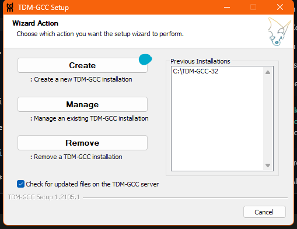
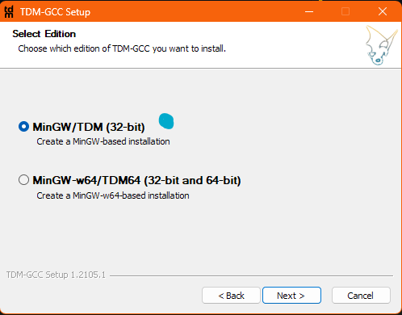

# Graphics library setup 

This is not my own sol. The main repo [solution-to-graphics.h](https://github.com/kumarbaberval/Solution-to-graphics.h)
## Quick setup

Install `TDM-GCC-32` from [here](https://github.com/jmeubank/tdm-gcc/releases/download/v10.3.0-tdm-1/tdm-gcc-10.3.0.exe)
|||
|--|--|

## Get all the files needed `graphics.h`, `winbgim.h` and `libbgi.a`

- Copy `graphics.h` and `winbgim.h` files to `TDM-GCC-32/include` folder.

location might be **("C:/TDM-GCC-32/include/")**

- Copy `libbgi.a` to file to `TDM-GCC-32/lib` folder.

location might be **("C:/TDM-GCC-32/lib")**

## My directory look like

```cmd
  D:.
├───.vscode
└───Home
    ├───build
    └───src
```

- Just `Ctrl+Shift+B` to run the build task you will get the executable file in build folder

## !mportant

- Folder `src` contains source code

- Folder `build` where compiler generate .exe

- .vscode contains c_cpp_properties.json and task require modification according to your environment and types compiler
